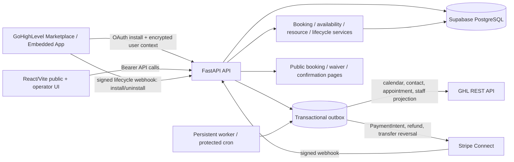

# Passport MVP — Complete Technical Audit

**Repository:** `https://github.com/moawiz-2706/MVP.git`  
**Commit audited:** `ef11c6e` (`main`, `origin/main`)  
**Audit date:** 2026-09-30  
**Scope:** FastAPI backend, React/Vite frontend, Supabase/PostgreSQL migrations, Stripe, GHL OAuth/API/webhooks, worker/outbox, deployment configuration, tests, and FareHarbor-style feature coverage.

> **Conclusion:** This is a substantial, coherent MVP with real booking, resource-capacity, payment, waiver, customer, staff, and GHL projection code. It is **not production-ready for paid traffic** until the lifecycle-policy and financial side effects are corrected, OAuth state is mandatory, the failing regression is fixed, deployment requirements are enforced, and skipped integration coverage is executed against PostgreSQL and real provider contracts.

## Executive summary

### What is already implemented

- Multi-tenant FastAPI application with SQLAlchemy 2 and PostgreSQL/Supabase migrations.
- Embedded GHL user-context handshake and short-lived in-memory frontend bearer sessions.
- GHL Marketplace OAuth installation, encrypted access/refresh-token storage, refresh-token rotation, location binding, and lifecycle webhook signature verification.
- Operator, location, category, calendar, availability, resource, staff, customer, waiver, report, and settings APIs.
- Calendar availability modes: weekly/day-wise, date-wise ranges, and pushed departure times.
- Shared resource pools with concurrent capacity calculations and row locking.
- Customer types, rate plans, per-rate taxes/fees, resource consumption, party-size rules, immutable booking snapshots, and custom-field storage.
- Public catalog, category pages, live availability, Stripe PaymentIntent checkout, access-token-protected status, waiver signing, cancellation, and zero-fee self-service rescheduling.
- Operator booking board, booking details, notes, participants, staff assignment, cancellation, status operations, weather closure, GHL retry, reporting, and CSV export.
- Durable outbox with leases, retries, idempotency keys, dead-letter state, GHL calendar/contact/appointment/staff projections, Stripe refund/transfer-reversal jobs, and a persistent worker.
- Backend unit/integration-style tests for many domain primitives and concurrency cases.

### Most important production blockers

| ID | Severity | Finding | Impact |
|---|---|---|---|
| F-01 | **Blocker** | Cancellation and rescheduling policies are not consistently evaluated from the booking snapshot; configured cancellation fees are not applied by the cancellation path. | Customers may receive refunds or be allowed/denied cancellation based on the wrong policy; revenue leakage and policy disputes. |
| F-02 | **Blocker** | `POST /bookings/{id}/status` accepts `cancelled` but directly changes status without the normal cancellation/refund/GHL-cancel workflow. | A valid authenticated operator/API caller can create a cancelled booking with no refund, no inventory/lifecycle side effects, and no GHL cancellation. |
| F-03 | **High** | OAuth callback treats `state` as optional. | CSRF/install-confusion risk; callback can provision a location without proving it was initiated by the installation browser. |
| F-04 | **High** | Backend test suite has one real failure and 80 skipped tests in the audit environment. | Staff-role validation is demonstrably broken; database/provider behavior is not covered by the default test command. |
| F-05 | **High** | Production runtime validation does not require `DATABASE_URL`, `FRONTEND_URL`, or production Stripe publishable/configuration values; defaults point to localhost. | Misconfigured production deployments can start and fail later or redirect users to localhost. |
| F-06 | **High** | No PostgreSQL RLS statements exist in the migration history. | Tenant isolation depends entirely on application predicates; a future direct Supabase/PostgREST exposure or missed predicate becomes a cross-tenant data risk. |
| F-07 | **High** | Weather `credit` and `manual_review` outcomes create a zero-value adjustment and no financial job. | The API reports an outcome that does not actually create a credit/refund/review amount or customer-facing resolution. |
| F-08 | **High** | Public/operator rescheduling can change a paid booking without a financial adjustment when the active policy has no fee; operator rescheduling does not enforce the configured cutoff correctly. | Under- or over-collection and policy bypass when quantity/time changes occur. |

### Overall readiness rating

| Area | Rating | Assessment |
|---|---|---|
| Domain foundation | **Good MVP** | Strong model/service separation, meaningful constraints, availability tests, and idempotent outbox foundations. |
| Booking integrity | **Needs hardening** | Resource concurrency is well-developed, but lifecycle transitions and financial adjustment semantics are inconsistent. |
| GHL projection | **Good one-way projection / partial reconciliation** | Calendar/contact/appointment/staff projection exists; inbound GHL changes are mostly not reconciled. |
| Security | **Needs hardening** | JWT/session and webhook verification are good; optional OAuth state, no RLS, broad iframe policy, and replay/origin concerns remain. |
| Frontend | **Functional but incomplete** | Core operator/public flows are wired; policy/custom-field/migration/reconciliation management surfaces are absent. |
| Test/release confidence | **Not release-ready** | Frontend gates pass; backend has one failure and many skipped database/provider tests; no full browser/payment smoke gate. |
| FareHarbor parity | **Partial** | Core activity/availability/rate/resource/checkout/waiver flows exist; commercial rules, robust lifecycle accounting, migration UI, and advanced operations are incomplete. |

## A. Current architecture

### System shape

Passport is the system of record for booking eligibility, availability, capacity, rate/pricing snapshots, payment state, waivers, customer records, and booking lifecycle. GHL is an external identity/CRM/calendar projection target. Stripe owns payment collection and Connect transfers; Passport stores the local financial state and queues refunds/reversals.

### Request and session flow

1. The operator UI opens inside a GHL iframe.
2. `GHLSessionProvider` requests `REQUEST_USER_DATA` from the parent window and accepts an encrypted payload.
3. The backend decrypts the GHL payload, verifies the active installed location, upserts the local user/membership, and returns a short-lived HS256 JWT.
4. The frontend stores the JWT only in module memory and sends it as a bearer token.
5. Backend authorization resolves the JWT, verifies the installation, operator membership, and `authz_version`, then applies role permissions.
6. Public pages do not use operator sessions. Public order status/cancellation/rescheduling use purpose-bound access-token digests stored in PostgreSQL.

### Booking lifecycle traced

#### Public/operator order creation

`POST /public/{operator}/orders` and authenticated `POST /bookings` both use `OrderService.create`:

1. Resolve an active/public calendar inside the operator tenant.
2. Resolve a rate/customer type or fall back to the legacy calendar price.
3. Validate calendar mode, hours, cutoff, blocks, quantity, max units, party-size limits, and resource inventory.
4. Lock calendar rows and resource rows, then re-run availability after locks.
5. Create `booking_orders`, `bookings`, `booking_line_items`, `booking_resources`, primary `booking_participants`, custom-field values, and `payments` in one database transaction.
6. For paid orders, create a PaymentIntent after the local hold is durable; provider-unknown failures create a reconciliation outbox job.
7. Queue GHL appointment/contact work. Inline processing is best effort; the worker is the durable path.
8. Stripe webhook reconciliation transitions payment/order/booking state and queues confirmation/transfer jobs.
9. Hold expiry marks stale pending bookings cancelled, revokes public credentials, records events, and queues GHL appointment cancellation.

**Strength:** resource locking and idempotent checkout keys are real safeguards.  
**Weakness:** the lifecycle mutation APIs do not all use the same financial/policy transition service.

#### Calendar lifecycle

Calendar configuration is handled by `ConfigurationService` and includes soft-delete semantics, hours/date-hours/pushed slots, blocks, resources, rates, categories, public settings, booking modes, and GHL sync enqueueing. Calendar changes enqueue GHL calendar projection and, where applicable, future appointment reconciliation.

**Strengths:** Passport owns availability and pricing rather than delegating decisions to GHL; historical booking snapshots are preserved.  
**Gaps:** deletion/recovery and inbound GHL reconciliation are not a full two-way sync system; policy and custom-field configuration are backend-only from the current frontend.

#### Staff lifecycle

GHL is the source of staff identity and availability. `GHLStaffUserService` syncs account users, permissions/status metadata, weekly/rolling availability, and deactivation. Passport stores `custom_role` and `StaffAssignment` records. Assignment checks working hours and prevents overlapping assignments through both service logic and a PostgreSQL exclusion constraint.

**Important product decision:** staff availability and role coverage do **not** block public booking. They are operational follow-up. This matches the repository documentation but differs from a conventional “staff check before sale” booking engine.

#### Resource lifecycle

Resources are operator-scoped quantity pools. Calendars and rates map resources with quantities per booking unit. Availability computes peak concurrent usage across intervals, including resources shared by multiple calendars. Resource rows are locked before final booking validation.

**Gap:** if a calendar/rate has no resource mapping, the effective capacity is `max_units_per_booking` or `1`; there is no independent aggregate calendar-slot capacity. Operators must model capacity through resources or the system permits effectively unlimited simultaneous bookings.

## B. Architecture diagram and trust boundaries

### Trust boundaries

- **Browser ↔ API:** bearer JWT for operator pages; public token for customer order actions; rate limiting on public order/status actions.
- **GHL ↔ API:** OAuth token exchange, encrypted context handshake, REST access-token refresh, signed lifecycle webhook.
- **Stripe ↔ API:** signed webhook and server-side PaymentIntent/refund/transfer APIs.
- **API ↔ database:** application-enforced operator predicates; no RLS in migrations.
- **API ↔ external side effects:** durable outbox; external calls are not part of the booking commit transaction.

### Recommended boundary change

Keep the current logical ownership boundary, but add database-enforced tenant defense in depth, a mandatory stateful lifecycle/adjustment service, and a reconciliation subsystem that treats external providers as projections rather than authorities.

## C. Database / ERD audit

### Conceptual ERD

```mermaid
erDiagram
    OPERATOR ||--|| OPERATOR_SETTINGS : has
    OPERATOR ||--|| GHL_INSTALLATION : installed_as
    OPERATOR ||--o{ OPERATOR_USER : membership
    APP_USER ||--o{ OPERATOR_USER : belongs_to
    OPERATOR ||--o{ LOCATION : owns
    OPERATOR ||--o{ CATEGORY : owns
    OPERATOR ||--o{ CALENDAR : owns
    CATEGORY ||--o{ CALENDAR : groups
    LOCATION ||--o{ CALENDAR : departure_for
    CALENDAR ||--o{ CALENDAR_HOUR : weekly_hours
    CALENDAR ||--o{ CALENDAR_DATE_HOUR : date_hours
    CALENDAR ||--o{ CALENDAR_PUSHED_SLOT : pushes
    CALENDAR ||--o{ CALENDAR_BLOCK : blocks
    OPERATOR ||--o{ RESOURCE : owns
    CALENDAR ||--o{ CALENDAR_RESOURCE : maps
    RESOURCE ||--o{ CALENDAR_RESOURCE : mapped_to
    OPERATOR ||--o{ CUSTOMER_TYPE : defines
    CALENDAR ||--o{ CALENDAR_RATE : offers
    CUSTOMER_TYPE ||--o{ CALENDAR_RATE : priced_as
    CALENDAR_RATE ||--o{ CALENDAR_RATE_RESOURCE : consumes
    RESOURCE ||--o{ CALENDAR_RATE_RESOURCE : consumed_by
    CALENDAR ||--o{ BOOKING_POLICY : versions
    OPERATOR ||--o{ CUSTOMER : owns
    CUSTOMER ||--o{ BOOKING_ORDER : places
    BOOKING_ORDER ||--|{ BOOKING : contains
    BOOKING_ORDER ||--|| PAYMENT : paid_by
    BOOKING ||--o{ BOOKING_LINE_ITEM : snapshots
    BOOKING ||--o{ BOOKING_RESOURCE : reserves
    RESOURCE ||--o{ BOOKING_RESOURCE : reserved_by
    BOOKING ||--o{ BOOKING_PARTICIPANT : manifests
    BOOKING ||--o| BOOKING_WAIVER : requires
    BOOKING ||--o{ BOOKING_NOTE : notes
    BOOKING ||--o{ BOOKING_EVENT : events
    BOOKING ||--o{ BOOKING_ADJUSTMENT : adjusts
    BOOKING ||--o{ STAFF_ASSIGNMENT : served_by
    STAFF ||--o{ STAFF_ASSIGNMENT : assigned
    BOOKING_ORDER ||--o{ OUTBOX_JOB : projects
    CALENDAR ||--o| GHL_CALENDAR_MAPPING : projected
    BOOKING ||--o| GHL_APPOINTMENT_MAPPING : projected
    PAYMENT ||--o{ PAYMENT_EVENT : events
    PAYMENT ||--o{ PAYMENT_REFUND_ATTEMPT : refunds
    GHL_INSTALLATION ||--o{ GHL_WEBHOOK_EVENT : receives
```

### Schema strengths

- UUID primary keys and scoped uniqueness for most tenant-owned identity.
- Snapshot columns preserve calendar/name/location/rate/fee/tax/policy values at booking time.
- PostgreSQL checks cover money non-negativity, time ordering, quantities, currency shape, role/range invariants, and booking total integrity.
- `staff_assignments_no_overlap` uses a PostgreSQL GiST exclusion constraint.
- Child-tenant trigger functions protect several operator/payment/booking relationships.
- Outbox and payment-intent idempotency keys are unique.
- Hold-expiry, booking-time, outbox-ready, and appointment-status indexes exist.

### Schema concerns

1. **No RLS:** no `ENABLE ROW LEVEL SECURITY`, `CREATE POLICY`, or equivalent statement exists in `supabase/migrations`. The API is tenant-scoped, but the database is not independently protected.
2. **Migration history has a numeric gap:** migration `009` is absent while `001–008` and `010+` exist. This is not automatically unsafe, but release tooling must apply by filename order and verify the expected schema rather than assuming contiguous numbering.
3. **Repair migrations indicate schema drift:** `024_resource_metadata_repair.sql` and `025_booking_page_schema_repair.sql` are useful idempotent repairs, but production release needs a single verified baseline or a documented compatibility matrix.
4. **Financial adjustment model exists but is not authoritative:** `booking_adjustments` is present, yet several status/weather/reschedule paths write zero or `none` adjustments rather than calculating and dispatching the required financial action.
5. **Customer detail is incomplete:** backend `CustomerDetail` currently returns `custom_fields: {}` and does not expose a complete waiver/payment/audit history despite the parity specification describing those fields.

## D. API audit

### Route groups and contracts

| Group | Representative endpoints | Auth | Backend behavior | Assessment |
|---|---|---|---|---|
| Health | `GET /api/health` | None | Liveness response | Implemented; should not be treated as readiness. |
| Auth/session | `POST /api/v1/auth/ghl-session`, `GET /me` | GHL encrypted context / bearer | Creates/validates local session and membership | Implemented; see OAuth/context findings. |
| OAuth | `GET /integrations/marketplace/oauth/start`, `/oauth/callback` | Browser flow | Exchanges code, fetches location, provisions installation | Implemented but callback state is optional. |
| GHL lifecycle | `POST /integrations/marketplace/webhook` | Ed25519 signature | Deduplicates and handles install/uninstall only | Partial inbound sync. |
| Catalog | `GET /public/{operator}`, category, rates, custom fields | Public | Public active/bookable catalog | Implemented. |
| Availability | Public calendar availability; authenticated calendar check | Public or bearer | Hours/blocks/cutoff/resource capacity | Implemented; no staff gate/general slot capacity. |
| Orders | Quote/create/status/cancel/reschedule | Public token for post-checkout | Creates holds, PaymentIntent, status, policy checks | Partial; lifecycle/accounting inconsistencies. |
| Configuration | Locations/resources/customer types/categories/calendars/hours/blocks/resources/rates | Bearer + permission | CRUD and outbox enqueueing | Implemented backend; policy/custom-field UI missing. |
| Booking operations | Detail/list/participants/notes/create/update/cancel/retry | Bearer + booking permission | Operator workflows | Mostly implemented; status endpoint bypasses lifecycle. |
| Staff | Directory, roles, assignments, candidates, conflicts | Bearer + permission | GHL identity cache + Passport assignments | Implemented operationally; one validation regression. |
| FareHarbor replica | Policies, custom fields, customers, reschedule/status/weather, migration, reconciliation | Bearer + permission | Backend parity foundations | Backend partial; frontend migration/policy/custom-field surfaces absent. |
| Payments | Stripe Connect links/status, Stripe webhook | Bearer or signed webhook | Payment reconciliation, transfers, refunds | Foundation implemented; adjustment outcomes incomplete. |
| Reports | Summary and CSV | Bearer + view permission | Bounded date reports | Implemented summary/export; detailed drilldowns missing. |
| Waivers | Public view/sign; operator settings | Public token or bearer | Signed waiver record and snapshot | Implemented. |
| Internal | Outbox and daily cron | Cron secret | Fallback processing/reconciliation | Implemented; worker remains operational requirement. |

### API consistency issues

- Domain errors are generally normalized, but several public paths catch broad exceptions and continue, which can hide reconciliation failures from the caller.
- `POST /bookings/{id}/status` accepts lifecycle statuses that need different side effects but routes them through one direct setter.
- Public cancellation returns `204` after calling a service that commits one booking at a time. Multi-item order cancellation can therefore partially complete if a later booking fails.
- Public reschedule response always reports `payment_outcome="unchanged"`; it is not a general fee/refund/credit adjustment contract.
- The migration/reconciliation APIs report simplified summaries and do not implement the full staged import and deterministic repair model described in the specification.

## E. GHL integration audit

### Custom App → GHL

| Operation | Implementation | Reliability |
|---|---|---|
| OAuth token exchange | `GHLAuthService.exchange_code` | Validates location token type, required scopes, access/refresh/user fields. |
| Token refresh | `GHLClient._load_token_from_db` | Row lock, refresh rotation, encrypted storage, permanent failure deactivation. |
| Calendar projection | `GHLCalendarService` via outbox | Idempotent mapping/recovery by Passport marker; external deletion/update recovery remains limited. |
| Contact projection | `GHLContactService` via outbox | Clear-match/upsert behavior; email immutability requires manual reconciliation. |
| Appointment projection | `GHLAppointmentService` via outbox | Idempotent mapping and create/update/cancel statuses. |
| Staff directory | `GHLStaffUserService` | Directory/availability sync and deactivation; scope and permission failures are surfaced. |
| Notifications | `GHLEmailService` | Disabled by default; no independent Passport email provider is present. |

### GHL → Custom App

- Signed lifecycle webhook handles `INSTALL` and `UNINSTALL`.
- Verified non-lifecycle events are persisted as `ignored`; calendar changes, appointment changes, contact changes, and provider-side staff changes are not reconciled through inbound webhooks.
- There is no complete bidirectional reconciliation loop that fetches and compares all GHL calendar/appointment projections against Passport desired state.
- This is acceptable only if explicitly defined as **Passport-authoritative with one-way GHL projection**. It is not a two-way synchronization system.

### GHL findings

1. **Optional OAuth state:** `oauth_callback` accepts `state=None` and proceeds to exchange/provision. Since `/oauth/start` always generates state, the callback should reject missing state in production.
2. **Broad iframe CSP:** backend and root Vercel config send `frame-ancestors https:`, allowing any HTTPS origin to frame the app. `frontend/vercel.json` is narrower, so deployment behavior differs depending on which manifest wins.
3. **Context replay/origin hardening:** the encrypted GHL context handshake is not visibly nonce-bound or origin-bound server-side; the frontend accepts any parent origin when `VITE_GHL_PARENT_ORIGINS` is empty. Production validation requires parent origins, but this should still fail closed in the frontend and bind the session context to an installation/browser flow where possible.
4. **Provider rate-limit semantics:** the client retries one 401 refresh but has no explicit 429/backoff policy; outbox retries the whole job with exponential delay, which is useful but not provider-aware.
5. **Notification contract mismatch:** settings copy describes GHL confirmation delivery, but `GHL_NOTIFICATIONS_ENABLED` defaults to false and there is no visible settings control or alternate mail provider.

## F. Frontend audit

### Implemented UI

- Embedded operator shell with navigation, session loading/error states, operation notices, responsive sidebar.
- Bookings calendar with month/week/day views, filters/search, booking drawer, notes, participants, status/cancellation/weather actions, staff assignment, GHL retry, and payment/waiver display.
- Calendar/category CRUD with general fields, availability modes, blocked dates, resources, rates, customer types, booking link, and manual booking modal.
- Resource, location, staff, customer, notification, report, Stripe settings, waiver settings, public catalog, public calendar, payment, confirmation, reschedule, and waiver signing pages.
- React Query caching/invalidation and a typed API client.

### Missing or disconnected UI

1. **Migration and reconciliation workspace is absent.** `main.tsx` has no migration/reconciliation route; no corresponding frontend files exist, despite README/docs claiming the operator workspace exposes it.
2. **Booking policy management is backend-only.** The API supports versioned booking policy CRUD, but Settings and Calendar editor have no policy editor. Operators cannot configure cancellation cutoff/fee, reschedule cutoff/fee, weather mode, no-show mode, deposit, or waiver requirement from the current UI.
3. **Custom-field definition management is backend-only.** Public checkout and operator booking consume custom fields, but no operator screen creates/edits/deactivates them.
4. **Customer profile editing is incomplete.** The customer drawer displays history and notes but has no profile edit form even though `PATCH /customers/{id}` exists.
5. **Reports are summary-only.** No detailed utilization, refunds/credits, customer activity, staff coverage, capacity drilldown, or reconciliation exception views.
6. **Public cart is single-step/single-item in the UI.** Backend schemas support multiple order items, but the public frontend selects one calendar/time and submits one item. Multi-item conflicts are not exercised by browser flow.
7. **Public checkout does not expose gift cards, promotions, extended paid options, or participant-level collection beyond the post-checkout waiver/primary manifest.** These are documented exclusions, not accidental placeholders.
8. **Frontend build is large:** production output is approximately 886 kB minified JS and Vite emits a chunk-size warning. This is not a correctness blocker but should be addressed before mobile/embedded performance work.

### Frontend/backend communication observations

- The API client uses same-origin `/api/v1` in production if `VITE_API_BASE_URL` is absent. This is correct only for a single combined deployment; separate Vercel projects require the documented variable.
- Auth/session token is kept in memory rather than localStorage, reducing persistence exposure.
- URL and image fields are rendered as external links/images. Backend schemas should enforce HTTPS URLs and frontend should reject unsafe schemes consistently; waiver website handling does add an `https://` prefix but should normalize more strictly.
- The public confirmation route carries the access token in the URL query string. `Cache-Control: no-store` and `Referrer-Policy: no-referrer` are set server-side, which is good, but URLs can still leak through browser history, screenshots, logs, or copied links. Consider a fragment/exchange flow for higher assurance.

## G. Security, reliability, performance, and deployment

### Security

**Good controls:**

- JWT audience/issuer/expiry validation and authorization-version invalidation.
- Encrypted GHL tokens at rest.
- Signed Stripe webhook verification and Ed25519 GHL webhook verification.
- Public access-token digests rather than raw token storage.
- Public rate limiting for quote/checkout/status/cancel/reschedule.
- Pydantic validation and SQLAlchemy parameterized queries.
- No hard-coded supplied credentials found; repository scan found no merge-conflict markers.

**Required fixes:**

- Make OAuth state mandatory and consume it for every callback.
- Add database RLS or a documented guarantee that Supabase APIs are disabled and only a locked-down server role can connect.
- Replace `frame-ancestors https:` with an explicit allowlist or a deployment-generated policy; align root and frontend Vercel manifests.
- Make embedded message handling fail closed when allowed origins are empty.
- Add CSP `default-src`, `script-src`, `connect-src`, `img-src`, `frame-src`, and Stripe-specific directives as deployment permits; current CSP only sets `frame-ancestors`.

### Reliability and concurrency

**Good:** resource row locking, `with_for_update`, range exclusion for staff assignments, outbox leases/fencing tokens, provider-unknown payment state, idempotency keys, hold expiry, and many domain concurrency tests.

**Gaps:**

- Lifecycle operations are not centralized; direct status setting bypasses financial/GHL side effects.
- Multi-booking order cancellation is not one atomic transaction at the service boundary.
- Weather credit/manual-review outcomes are not actionable financial workflows.
- No provider-aware 429 retry/backoff or circuit-breaker behavior.
- No full end-to-end test that runs checkout → Stripe webhook → confirmation → waiver → cancellation/refund → GHL projection.

### Performance

- Availability correctly batches reservation queries for public day views, but rate/resource loops still create repeated queries per rate and can grow with configured rates/resources.
- Customer listing computes counts/latest/paid totals per customer, creating an N+1 query pattern at scale.
- Staff and notification badges poll every 15–45 seconds from the operator shell; this is acceptable for a small MVP but should be consolidated or server-pushed later.
- Frontend bundle is large and should be code-split by operator/public route.

### Deployment

- Vercel manifests exist for combined frontend/backend and separate frontend deployment.
- The persistent worker is a real requirement for near-real-time outbox and hold expiry; Vercel Cron is only a fallback.
- `Settings.validate_runtime()` checks many secrets but does not reject default/local `DATABASE_URL` or `FRONTEND_URL`, and does not validate that production frontend API/Stripe public configuration is present.
- The repository has no container or infrastructure-as-code definition for the required persistent worker. Deployment documentation must specify the worker host, process supervision, health checks, and alerting.
- Root `vercel.json` and `frontend/vercel.json` define different CSP policies; verify which is active for each project.

## H. Feature gap matrix

| Feature | Status | Existing implementation | Missing/broken work | Priority |
|---|---|---|---|---|
| Calendar management | **Fully implemented core / partial parity** | CRUD, soft deletion, categories, locations, links, GHL projection | Full inbound reconciliation and robust delete repair | P1 |
| Booking management | **Partially implemented** | Public/operator creation, holds, detail, notes, participants, cancellation, status, weather, reschedule | Central transition service, atomic multi-item lifecycle, financial outcomes | P0 |
| Staff management | **Partially implemented** | GHL directory/availability sync, Passport roles, assignments/conflicts | Fix failing role validation; optional hard coverage rules/pools | P0/P2 |
| Staff pools | **Partial** | Role labels and assignment candidates | Explicit pool/capacity semantics and UI if required | P2 |
| Resource pools | **Fully implemented core** | Shared pools, mappings, capacity and locks | General calendar capacity fallback and scale optimization | P1 |
| Availability | **Fully implemented core** | Day/date/pushed modes, blocks, timezone/DST validation | Full regression against production database and calendar capacity semantics | P1 |
| Capacity | **Partial** | Resource peak concurrency and max units | Independent slot capacity when no resource is mapped | P1 |
| Payments | **Partial** | Stripe Connect, PaymentIntent, webhooks, refunds/reversals foundation | Policy-aware adjustment ledger and test-mode E2E | P0 |
| GHL synchronization | **Partial** | OAuth, token refresh, calendar/contact/appointment/staff projection, lifecycle webhook | Inbound reconciliation, 429 strategy, remote-delete repair | P1 |
| External calendar sync | **Missing** | GHL calendar/appointment projection only | Google/Outlook or other external calendar integration if required | P2 |
| Notifications | **Partial** | Outbox email adapter and in-app notifications | Default delivery provider, visible configuration, delivery observability | P1 |
| Reporting | **Partial** | Summary metrics and CSV | Drilldowns, utilization, refunds, waivers, customer/staff metrics | P2 |
| Customers | **Partial** | Deduplication, list/detail, notes, booking history | Edit UI, custom-field/waiver history, pagination and aggregate query optimization | P1 |
| Migration | **Backend partial / frontend missing** | Staged minimal import and reconciliation API | Full validation/mapping/commit UI and import semantics | P1 |
| Booking policies | **Backend implemented / frontend missing** | Versioned policy model/API | Operator editor; enforce captured version in actions | P0 |
| Custom fields | **Backend partial / frontend missing** | Definition/value APIs and public rendering | Operator management, typed validation, historical snapshots in detail | P1 |
| Gift cards | **Missing** | None | Immutable liability ledger, redemption, refund reversal, concurrency tests | P2 |
| Discounts/promotions | **Missing** | None | Campaign/coupon/eligibility/usage ledger and quote integration | P2 |
| Mobile/responsive UX | **Partial** | Responsive CSS and public/operator layouts | Browser visual/accessibility regression and bundle splitting | P2 |

## I. Critical issues and remediation details

### F-01 — Policy snapshots and cancellation fees are not enforced consistently

**Evidence:** `backend/app/api/v1/orders.py:211–226` selects the active policy instead of `booking.booking_policy_version`. `BookingAdminService.cancel` allocates and refunds based on the full customer total; it does not calculate the configured `cancellation_fee_bps`. `booking_policy_version` is stored, proving the schema intended historical evaluation.

**Fix:** create `PolicyService.resolve_for_booking(booking)` that loads the exact version, with an explicit fallback only for legacy rows. Create `AdjustmentService` that calculates refund/credit/fee from immutable payment and policy snapshots. Use it for public cancellation, operator cancellation, weather cancellation, and status transitions.

### F-02 — Direct status mutation bypasses lifecycle side effects

**Evidence:** `POST /bookings/{booking_id}/status` accepts cancellation through `FareHarborReplicaService.status`, assigns `booking.status`, writes a zero `none` adjustment, and commits. It does not clear/release resources consistently, enqueue GHL cancellation, or create Stripe refund/reversal attempts.

**Fix:** reject `cancelled` from the generic status endpoint or dispatch it to the same cancellation transition command used by the cancel endpoint. Define an explicit transition table for `pending_payment`, `confirmed`, `completed`, `no_show`, `cancelled`, `failed`, and terminal states.

### F-03 — OAuth callback accepts missing state

**Evidence:** `oauth_callback` branches to `state_row = None` when `state` is absent and continues to token exchange/provisioning.

**Fix:** in production require both query state and matching HttpOnly cookie, consume the state exactly once, validate expected location, clear the cookie, and reject the callback when state is absent. Add tests for missing, mismatched, expired, reused, and wrong-location state.

### F-04 — Failing regression and skipped database tests

**Evidence:** `test_staff_pool_roles_are_independent` expects `CalendarCreate(required_staff_roles=[])` to raise but it does not. Audit command result: **100 passed, 1 failed, 80 skipped**. The skipped tests are primarily gated on `TEST_DATABASE_URL`.

**Fix:** decide whether empty role arrays are invalid or whether the test is obsolete. Align schema, migration defaults, docs, frontend payload (`required_staff_roles: []`), and tests. Run the full suite against a disposable PostgreSQL instance in CI.

### F-05 — Production configuration can silently retain local defaults

**Evidence:** `database_url` defaults to localhost PostgreSQL and `frontend_url` defaults to `http://localhost:5173`. `validate_runtime()` does not require either value. The frontend needs `VITE_API_BASE_URL` when deployed as a separate Vercel project, and `VITE_STRIPE_PUBLISHABLE_KEY` is not a backend runtime check.

**Fix:** require explicit production database/frontend/API/Stripe public configuration, validate URL schemes/hosts, and add a startup readiness check that opens a database connection and verifies migration/schema version.

### F-06 — No RLS defense in depth

**Evidence:** migration scan found no RLS statements. Tenant predicates are present in application services, but this is not an independent database boundary.

**Fix:** either add RLS policies keyed to a trusted transaction setting and use a restricted DB role, or formally isolate Supabase PostgREST and prevent direct table exposure. Add cross-tenant integration tests at both API and database role levels.

### F-07 — Weather credit/manual review outcomes are placeholders

**Evidence:** non-`full_refund` weather paths create `BookingAdjustment(action='credit'|'manual_review', amount_minor=0, status='pending')`; no credit ledger or refund/manual-review outbox is created.

**Fix:** calculate the affected payment amount, create an immutable adjustment, and route `credit`, `refund`, and `manual_review` to separate durable workflows with operator/customer outcome visibility.

### F-08 — Reschedule accounting and cutoff are incomplete

**Evidence:** public reschedule checks the active policy and then calls `BookingAdminService.reschedule`, which uses `allow_paid_reschedule=True`; the response hard-codes `payment_outcome='unchanged'`. The operator replica route checks whether the new start is after the old start rather than enforcing the configured current-time cutoff.

**Fix:** evaluate the booking policy snapshot, validate the current time against cutoff, compute price/resource/fee deltas, create an adjustment, and return `none|collect_payment|refund|credit|manual_review` with a payment action when required.

## J. Recommended architecture evolution

### Preserve

- Passport as authoritative booking/inventory/pricing/payment/waiver system.
- GHL as identity, contact, calendar, appointment, and staff projection target.
- PostgreSQL as the transaction boundary.
- Outbox for all external side effects.
- Short-lived bearer sessions and purpose-bound public credentials.

### Add

1. **Lifecycle command layer:** one state machine for cancel, reschedule, complete, no-show, expire, weather close, and payment confirmation.
2. **Financial adjustment ledger:** immutable booking adjustments, allocation snapshots, refund/credit/charge actions, provider references, and reconciliation states.
3. **Policy snapshot resolver:** every booking mutation uses the captured policy version.
4. **Reconciliation engine:** desired Passport projection vs observed GHL object, with repair runs and exception records.
5. **Database isolation:** RLS or a formally restricted database access model.
6. **Release gates:** migration verification, API contract tests, browser smoke tests, provider contract fixtures, concurrency suite, accessibility, and deployment readiness checks.

## K. Implementation roadmap

### Phase 0 — Release gate and safety fixes

- **Features:** fix failing role validation; make OAuth state mandatory; reject local production defaults; align CSP; document worker deployment.
- **Files/modules:** `backend/app/api/v1/ghl_oauth.py`, `backend/app/schemas/configuration.py`, `backend/app/core/config.py`, `backend/app/main.py`, both Vercel manifests, CI/test setup.
- **Database:** add schema/version health check; verify migration chain 001–027 on disposable PostgreSQL.
- **API/GHL:** no behavior expansion; secure callback and lifecycle entrypoints.
- **Dependencies:** PostgreSQL/Supabase staging database, GHL OAuth test app.
- **Tests:** backend suite with `TEST_DATABASE_URL`, OAuth state cases, startup config tests, CSP assertions.
- **Risk:** changing OAuth state behavior may affect existing installation links; support only the documented `/oauth/start` flow.

### Phase 1 — Booking lifecycle and accounting integrity

- **Features:** central state machine, policy-version resolution, cancellation fee/refund outcomes, paid reschedule adjustment, weather refund/credit/manual review.
- **Files/modules:** new `policy_service.py` and `adjustment_service.py`; refactor `booking_admin_service.py`, `fareharbor_replica_service.py`, `orders.py`, `reservation_lifecycle_service.py`, Stripe refund/transfer services.
- **Database:** expand `booking_adjustments`, add immutable policy/financial allocation snapshots and provider action references if needed.
- **API:** versioned transition responses with action/outcome; remove direct cancellation from generic status setter.
- **GHL:** queue appointment update/cancel only after local transition commits.
- **Dependencies:** Stripe test mode and transfer/reversal fixtures.
- **Tests:** cancellation cutoff/fee matrix, policy changes after booking, multi-item atomic cancellation, paid reschedule delta, weather modes, retry/idempotency, expired holds.
- **Risk:** accounting regressions; run dual calculations against existing orders in staging before enabling.

### Phase 2 — Database isolation and reconciliation

- **Features:** RLS/restricted role, schema health/readiness, GHL desired-vs-observed reconciliation, 429/backoff, dead-letter repair UI/API.
- **Files/modules:** migrations, `database.py`, `ghl_client.py`, `ghl_webhook_service.py`, new reconciliation services/routes.
- **Database:** RLS policies, reconciliation runs/exceptions, provider request IDs and observed revision fields.
- **API/GHL:** support deterministic calendar/contact/appointment repair; persist ignored event types with actionable reason.
- **Dependencies:** Supabase role/RLS testing, GHL sandbox or contract fixtures.
- **Tests:** cross-tenant DB tests, remote-delete/update reconciliation, duplicate webhook/retry tests, 429 and token-refresh concurrency.
- **Risk:** RLS can break existing SQLAlchemy access if session context is not set consistently; roll out in shadow/test mode.

### Phase 3 — Complete operator surfaces

- **Features:** policy editor, custom-field editor, migration/reconciliation UI, customer profile editing, booking adjustment history, detailed exceptions.
- **Files/modules:** new frontend pages/components under `frontend/src/`; routes in `main.tsx`; backend response schemas for customer/audit details.
- **Database:** only where API contract identifies missing snapshots/history.
- **API:** pagination, detail drilldowns, typed custom-field validation, import mapping/commit semantics.
- **GHL:** no new authority; expose projection status and repair actions.
- **Dependencies:** product decisions for migration file formats and policy UX.
- **Tests:** component/API contract tests, browser workflows, import dry-run/commit tests.
- **Risk:** avoid presenting backend placeholders as complete UI.

### Phase 4 — FareHarbor commercial parity

- **Features:** promotions/discounts, gift-card liability ledger, optional paid options, participant data collection, credits.
- **Files/modules:** new ledger/rules services, quote/order schemas, public checkout/cart components.
- **Database:** immutable promotion usage, gift-card issuance/redemption/reversal, line-item extensions.
- **API/GHL:** quote recalculation and appointment metadata projection; GHL remains non-authoritative.
- **Dependencies:** accounting and refund policy sign-off.
- **Tests:** concurrency-safe redemption, stacking/eligibility, refund reversal, quote immutability, payment failures.
- **Risk:** financial liability and tax treatment; do not expose UI before ledger tests pass.

### Phase 5 — Performance, accessibility, and operations

- **Features:** code splitting, query aggregation/pagination, structured logs/metrics, alerting, visual/accessibility regression, external calendar connectors if required.
- **Files/modules:** frontend route imports, customer/report query services, deployment manifests, worker health endpoint/process config.
- **Database:** aggregate/report indexes and bounded query plans.
- **API/GHL:** metrics for outbox age, dead jobs, token failures, webhook failures, payment provider-unknown state.
- **Tests:** Lighthouse/accessibility, Playwright smoke, load tests for availability and checkout, worker restart/recovery.
- **Risk:** optimization can change query semantics; keep domain tests as contract gates.

## L. Testing strategy

### Current verification performed

- Repository cloned at the current `main` commit; working tree returned clean after tests.
- Python compilation passed for backend source.
- Backend test result: **100 passed, 1 failed, 80 skipped**.
- Frontend `npm ci` completed with no reported vulnerabilities.
- Frontend TypeScript check passed.
- Frontend booking-notification unit test passed.
- Frontend production Vite build passed and emitted the documented chunk-size warning.
- `git diff --check` passed.
- Static scan found no merge-conflict markers or supplied credential literals.
- ORM table names matched migration `CREATE TABLE` symbols in a lightweight parity scan: 55/55.
- Migration filenames were numbered 001–008 and 010–027; 009 is absent.

### Required CI gates

1. **Unit:** money, timezone/DST, identifiers, capacity interval math, schema validators, policy transitions.
2. **Database integration:** apply all migrations to disposable PostgreSQL; run all currently skipped tests; verify constraints, triggers, exclusion ranges, and RLS.
3. **API contract:** FastAPI route tests for every public/operator/internal group, normalized error payloads, permissions, and tenant boundaries.
4. **Booking concurrency:** last resource unit, shared resource across calendars, simultaneous same checkout key, multi-item overlap, hold expiry vs payment webhook, cancellation vs reschedule.
5. **Payments:** PaymentIntent creation, provider-unknown recovery, successful/failed/refunded/partially-refunded webhooks, transfer reversal, idempotency, currency/amount mismatch quarantine.
6. **GHL contract:** OAuth state/location/scopes, token refresh rotation, calendar create/update/delete recovery, contact matching, appointment create/update/cancel, staff reconciliation, lifecycle webhook duplicate/replay/unsupported events, 401/403/404/429 handling.
7. **Lifecycle:** policy version changes after booking, cancellation fee/cutoff, no-show/completion, weather outcomes, paid reschedule adjustments, public token expiry/revocation.
8. **Frontend browser smoke:** operator session, calendar CRUD, availability/resource/rate/policy setup, manual booking, public booking, Stripe test payment, confirmation, waiver, cancellation, reschedule, GHL retry.
9. **Accessibility/responsive:** keyboard navigation, labels, focus traps in modals/drawers, mobile public checkout, iframe rendering, color contrast.
10. **Deployment:** production env validation, combined/separate Vercel routing, migration readiness, worker start/restart, cron auth, CSP headers, health/readiness, observability.

## Final recommendation

Do **not** begin a broad feature expansion until Phase 0 and Phase 1 are complete. The current codebase has enough real functionality to justify hardening rather than replacement, but the financial/lifecycle paths must be made authoritative and uniform before live paid bookings. After those fixes, add database isolation and reconciliation, then implement the missing operator surfaces that the documentation currently claims exist.

No source code was modified during this audit; only temporary test/build artifacts were created and removed from the audit workspace.
