# Passport Production ERD and Release Checklist

## Purpose and source-of-truth boundary

Passport/PostgreSQL is authoritative for product configuration, customer-type pricing, inventory, booking state, participants, waivers, payment projections, refunds, and operational history. Stripe is authoritative for provider payment observations. GoHighLevel is a downstream projection limited to calendar synchronization, appointment synchronization, contact synchronization, and staff identity synchronization. GHL failure must not change the local booking outcome.

## Production ERD

```mermaid
erDiagram
    OPERATORS ||--o{ CALENDAR_CATEGORIES : owns
    OPERATORS ||--o{ CALENDARS : owns
    CALENDAR_CATEGORIES o|--o{ CALENDARS : groups
    OPERATORS ||--o{ RESOURCES : owns
    CALENDARS ||--o{ CALENDAR_RESOURCES : maps
    RESOURCES ||--o{ CALENDAR_RESOURCES : supplies
    CALENDARS ||--o{ CALENDAR_RATES : prices
    CUSTOMER_TYPES ||--o{ CALENDAR_RATES : classifies
    CALENDAR_RATES ||--o{ CALENDAR_RATE_RESOURCES : consumes
    RESOURCES ||--o{ CALENDAR_RATE_RESOURCES : supplies
    CALENDARS ||--o{ CALENDAR_HOURS : opens
    CALENDARS ||--o{ CALENDAR_DATE_HOURS : overrides
    CALENDARS ||--o{ CALENDAR_BLOCKS : blocks
    CALENDARS ||--o{ CALENDAR_PUSHED_SLOTS : publishes
    OPERATORS ||--o{ BOOKING_ORDERS : receives
    BOOKING_ORDERS ||--|{ BOOKINGS : contains
    CALENDARS ||--o{ BOOKINGS : schedules
    BOOKINGS ||--o{ BOOKING_RESOURCES : consumes
    RESOURCES ||--o{ BOOKING_RESOURCES : consumed
    BOOKINGS ||--o{ BOOKING_LINE_ITEMS : snapshots
    BOOKINGS ||--o{ BOOKING_PARTICIPANTS : manifests
    BOOKINGS ||--o{ BOOKING_WAIVERS : requires
    BOOKINGS ||--o{ BOOKING_NOTES : records
    BOOKINGS ||--o{ BOOKING_EVENTS : changes
    BOOKING_ORDERS ||--o| PAYMENTS : charges
    PAYMENTS ||--o{ PAYMENT_EVENTS : observes
    PAYMENTS ||--o{ PAYMENT_REFUND_ATTEMPTS : refunds
    OPERATORS ||--o{ STAFF : employs
    STAFF ||--o{ STAFF_ASSIGNMENTS : assigned
    CALENDARS ||--o{ STAFF_ASSIGNMENTS : staffed
    OPERATORS ||--o{ OUTBOX_JOBS : queues
    CALENDARS ||--o| GHL_CALENDAR_MAPPINGS : projects
    BOOKINGS ||--o| GHL_APPOINTMENT_MAPPINGS : projects
    OPERATORS ||--o{ PUBLIC_ACCESS_CREDENTIALS : issues
    OPERATORS ||--o{ MIGRATION_IMPORTS : stages
    MIGRATION_IMPORTS ||--o{ MIGRATION_IMPORT_ROWS : contains
    OPERATORS ||--o{ RECONCILIATION_RUNS : audits
```

Migration `021_production_booking_hardening.sql` adds `booking_participants`, `booking_events`, and `payment_events`; it also adds indexes, credential and money checks, staff-assignment overlap protection, and append-only triggers. The migration chain, rather than a hand-copied schema dump, is the authoritative contract.

## Booking and payment lifecycle implemented in this build

A paid booking is created as a local `pending_payment` hold, with a payment-intent request, a public status credential, a GHL appointment projection, and immutable line-item data. Stripe success promotes the local order and booking to confirmed. The persistent worker and protected daily fallback now sweep expired holds under row locks, skip payment states that have already succeeded or are still processing, cancel eligible local bookings, revoke public capabilities, append a booking event, and queue an idempotent GHL appointment cancellation.

Public order status now verifies the purpose-bound access credential before any optional Stripe reconciliation. The status endpoint is read-only from the caller's perspective; reconciliation runs only after authorization. Operator-created payment flows preserve the access token through the Stripe confirmation URL.

Provider-unknown payment reconciliation now searches Stripe PaymentIntents by immutable booking-order metadata when the local provider ID was not returned, then validates the order ID, amount, and currency before attaching the provider ID and replaying the normal webhook projection.

## Operator functionality in the merged frontend

The operator console includes calendar, category, location, resource, staff, booking, customer, migration/reconciliation, and booking-setup workspaces. Calendar setup supports customer types, rate plans, rate-specific inventory, party-size rules, booking modes, cutoffs, and custom fields. Booking operations support edits, cancellation, weather closure, status transitions, notes, GHL retry, payment details, waiver state, and a participant manifest editor. Public checkout supports rate selection, resource-aware availability, booking policy states, custom fields, payment, waiver, and confirmation routes.

## Required deployment gates

| Gate | Required verification before live paid traffic |
|---|---|
| Database | Apply migrations 001–021 in order to a disposable PostgreSQL database and staging clone; run catalog checks for constraints, triggers, indexes, and row counts. |
| Stripe | Exercise successful, failed, duplicate, timeout/provider-unknown, late-success-after-expiry, refund, and transfer-reversal cases in Stripe test mode. |
| GHL | Reauthorize with only contacts, calendars/events, locations, and approved staff-read scopes. Verify calendar, appointment, contact, and staff sync independently; messaging remains disabled by default. |
| Worker | Run `python worker.py` continuously with monitoring for stale leases, dead outbox jobs, expired holds, provider-unknown payments, and failed GHL mappings. |
| Import | Use migration dry-run/staging validation first. Historical imports must not create PaymentIntents or customer messages and must reconcile customers, bookings, participants, payments, waivers, occupancy, and refunds. |
| Public links | Test operator, category, calendar, embed, checkout, Stripe confirmation, status, waiver, and deep-link fallback routes from the real deployed domains. |
| Security | Verify every public status request requires its purpose-bound token; use HTTPS, intentional CSP/frame policy, redacted logs, rotated legacy waiver links, and production secrets. |
| Operations | Verify participant manifests, waiver policy, staff assignment policy, refund/cancellation policy, audit history, exports, and operator exception queues with a real Kayak test dataset. |

This build closes the highest-risk application gaps, but applying migration 021 and completing the staging-provider gates remain mandatory before describing the deployment as production-ready.
